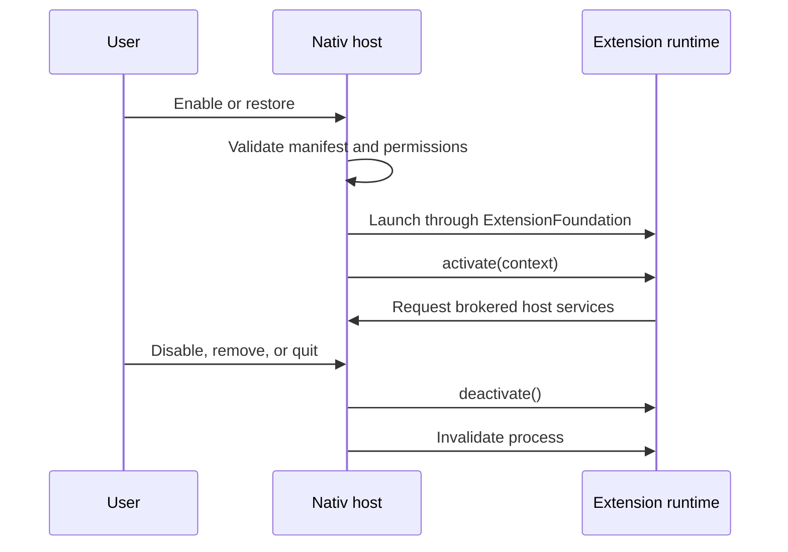

# Nativ extensions

Nativ extensions are independently versioned capabilities that contribute pages,
commands, shortcuts, and settings to the host app. First-party extensions can live
in this repository and ship inside `Nativ.app`; third-party extensions use the same
manifest and SDK contracts and can be installed from a `.nativextension` package.

Audio is the reference first-party extension. Voice dictation is one of its current
capabilities. It is installed and enabled by default, but a user can disable or
remove it and restore it later.

## Repository layout

```text
Sources/
├── NativExtensionSDK/                   # Stable public contracts
└── Nativ/Features/Extensions/           # Host registry, broker, and management UI
Extensions/
└── VoiceDictation/
    ├── Manifest.json                    # Declarative identity and contributions
    └── Runtime/                         # ExtensionFoundation process entry point
```

Keep reusable contracts in `NativExtensionSDK`. Keep privileged implementations in
the host. An extension requests host services through the SDK's XPC protocol instead
of importing app internals.

## Package format

A local package is a directory ending in `.nativextension`:

```text
Example.nativextension/
├── Manifest.json
└── Runtime.appex                        # Optional ExtensionFoundation runtime
```

The host validates `Manifest.json` before copying the package into:

```text
~/Library/Application Support/Nativ/Extensions/
```

External extensions begin disabled so their permissions can be reviewed before they
run. Included first-party extensions begin enabled. Their install state is durable
across launches, and only code shipped inside `Nativ.app` may set `included` to
`true`.

## Manifest

The schema is defined by `NativExtensionManifest`:

```json
{
  "schemaVersion": 1,
  "id": "com.example.my-extension",
  "version": "1.0.0",
  "minimumNativVersion": "0.1.0",
  "displayName": "My Extension",
  "summary": "Adds a capability to Nativ.",
  "developer": "Example",
  "systemImage": "puzzlepiece.extension",
  "included": false,
  "runtime": "extensionFoundation",
  "extensionPoint": "com.nativ.extension",
  "runtimeBundleIdentifier": "com.example.my-extension.runtime",
  "contributions": {
    "sidebar": [],
    "commands": [],
    "shortcuts": [],
    "settings": []
  },
  "permissions": ["storage.namespaced"]
}
```

Identifiers must be reverse-domain names. Versions use semantic versioning. Nativ
rejects unsupported schemas, incompatible minimum host versions, and duplicate
contribution identifiers.

## Lifecycle



The activation context includes the host version, extension identifier, granted
permissions, and a namespaced data directory. Deactivation must stop shortcuts,
recording, overlays, observers, and other background work.

For first-party features that still need in-process SwiftUI views, implement
`NativHostExtension`. The host adapter owns the feature coordinator and supplies its
page while the runtime process establishes the stable isolation boundary. Moving more
logic across XPC does not require changing the manifest or navigation model.

## Contributions

- `sidebar` adds a page to the main sidebar.
- `commands` exposes named actions that the host can place in menus or invoke.
- `shortcuts` declares configurable global actions and their defaults.
- `settings` declares settings surfaces owned by the extension.

The host only renders contributions for extensions that are installed, enabled, and
have an available host adapter or runtime. Removing Audio therefore removes its page
from navigation and stops its global shortcuts immediately.

Included extensions are enabled by default unless their manifest sets
`enabledByDefault` to `false`. External extensions always start disabled.

## Permissions and host services

Permissions are declared up front and enforced again by the XPC broker:

- `microphone`
- `accessibility.insertText`
- `models.speechToText`
- `overlay`
- `notifications`
- `storage.namespaced`

The SDK currently defines broker operations for host information, model discovery,
audio transcription, global shortcut registration, overlays, cursor insertion, and
namespaced storage. The host owns macOS consent prompts and validates every request
against the connected extension ID and its granted permissions.

Extensions must not persist raw microphone audio unless the feature explicitly
requires it. Audio's voice dictation feature retains recordings only for its existing
five-minute retry window.

## Adding a first-party extension

1. Create `Extensions/<Name>/Manifest.json`.
2. Add an ExtensionKit target that links `NativExtensionSDK`.
3. Bind its `AppExtensionPoint` to the Nativ host and export
   `NativExtensionXPCProtocol`.
4. Add a `NativHostExtension` adapter only when the feature contributes an in-process
   SwiftUI page or temporarily relies on existing host code.
5. Register the adapter in `AppDelegate`.
6. Add manifest validation and install-state tests.

First-party extension code may stay in this repository, but it must remain in its own
target and must communicate through the SDK boundary. This keeps atomic changes easy
while preserving the option to split an extension into another repository later.

## Compatibility rules

- Additive SDK changes are preferred.
- Breaking manifest changes require a new `schemaVersion`.
- Breaking XPC changes require a new protocol surface or negotiated capability.
- An extension must set `minimumNativVersion` when it relies on a newer host service.
- Host services must fail with a structured error when a permission or operation is
  unavailable; an extension process must never crash the host.
